# Descripción
Casanova-SWGH es un sistema web simple para la gestión de ventas y reserva de citas. (enfocado en una pequeña clínica). Desarrollado utilizando Laravel 12 y VueJS 3.

## Características
- Gestión de medicamentos y productos (CRUD)
- Gestión de proveedores (CRUD)
- Gestión de pacientes y clientes (CRUD)
- Gestión de doctores (CRUD)
- Gestión de horario e indisponibilidades de doctores
- Reserva de citas tomando en cuenta horarios de doctores, indisponibilidades, feriados y colisiones entre reservas.
- Gestión de presentaciones de medicamentos y productos (CRU)
- Gestión de usuarios del sistema (Crear, deshabilitar, resetear credenciales y envío de e-mail de recuperación)
- Gestión de trabajadores (Secretaria y Enfermera)
- Gestión de tratamientos (CRU)
- Módulo simple de ventas (Búsqueda de medicamentos y productos por código de barras EAN-13, pago de citas pendientes y pago de tratamientos)
- Visualización y búsqueda de comprobantes de pago (PDF)
- Listado simple de reembolsos pendientes
- Historial médico simple (Listado de notas del doctor por cita)
- Recuperación de credenciales de acceso (Envío de e-mail)
- Permisos de acceso al sistema según roles (ADMINISTRADOR/DOCTOR/SECRETARIA/ENFERMERA)
- Reporte simple de ventas y citas (por mes y año)
- Configuración del sistema (IGV, RUC, dirección, habilitar/deshabilitar jornada laboral en fines de semana, costo de cita)


## Tecnologías y dependencias
- [VueJS 3](https://vuejs.org/) (Frontend)
- [Laravel 12](https://laravel.com/docs/12.x/installation) (Backend)
- [Tailwind](https://tailwindcss.com/) (Interfaces)
- [Flowbite](https://flowbite.com/) (Interfaces)
- [SweerAlert2](https://sweetalert2.github.io/) (Alertas)
- [PHP-Open-Source-Saver/jwt-auth](https://github.com/PHP-Open-Source-Saver/jwt-auth) (Librería JWT)
- [milon/barcode](https://github.com/milon/barcode) (Generador de códigos de barras)
- [barryvdh/laravel-dompdf](https://github.com/barryvdh/laravel-dompdf) (Librería para PDF)

## Requisitos
- PHP Versión >=8.2
- [Extensiones necesarias para Laravel.](https://laravel.com/docs/12.x/deployment#server-requirements)
- [PHP GD Extension](https://www.webassist.com/tutorials/Enabling-the-GD-library-setting)
- [Composer](https://getcomposer.org/download/)
- NodeJS Version >= 18.19.1
- Base de Datos (PostgreSQL recomendada).

## Uso
Cumplidos los requisitos para ejecutar Laravel y VueJS puedes probar el sistema siguiendo estos pasos:

- Clonar el repositorio. `git clone https://github.com/zNahuelz/casanova-swgh-vuejs.git`
----
### Configuración de backend
- Debes crear un archivo .env en el directorio rest-api usando como referencia el archivo .env.example del mismo directorio.
- Configura la conexión a la base de datos en él .env (PostgreSQL recomendada): 
```DB_CONNECTION=pgsql
DB_HOST=127.0.0.1
DB_PORT=5432
DB_DATABASE=NOMBRE_BD
DB_USERNAME=USUARIO_BD
DB_PASSWORD=CONTRASEÑA_BD
```
- Configurar el servicio de correo para envío de emails en el .env (Se utilizó Gmail durante las pruebas). Debes generar una contraseña de aplicación, puedes seguir la guía oficial de Google [aquí](https://support.google.com/accounts/answer/185833?hl=es):
```
MAIL_MAILER=smtp
MAIL_SCHEME=null
MAIL_HOST=smtp.gmail.com
MAIL_PORT=465
MAIL_USERNAME=CORREO_GMAIL
MAIL_PASSWORD=CONTRASEÑA_APP_GMAIL
MAIL_FROM_ADDRESS="noreply@alternativac.com"
MAIL_FROM_NAME="ALTERNATIVAC CLINICA - SISTEMAS"
```
- Añadir URL del frontend en la configuración.
`
VUEJS_FRONTEND_URL="http://localhost:3000"
`
- Configurar idioma para generación de datos de prueba usando Faker.
`
APP_FAKER_LOCALE="es_PE"
`
- Descargar dependencias del proyecto (en directorio rest-api): `composer install`
- Generar clave del proyecto: `php artisan key:generate`
- Generar clave para tokens JWT: `php artisan jwt:secret`
- Ejecutar inicialización de la base de datos: `php artisan migrate --seed` 
- Esto creará 6 cuentas de usuario por defecto; los datos de acceso de la cuenta de administrador son: usuario; admin y contraseña; admin. También crea datos de medicamentos, presentaciones, proveedores y clientes de prueba. Pueden ser modificados en el sistema o con un gestor de bases de datos.
- Las cuentas de prueba para doctores son: doctor, doctor2, doctor3 (Mismo usuario-contraseña)
- Las cuenta de prueba para enfermera es: enfermera, en el caso de secretaria es: secretaria (Mismo usuario-contraseña)
- Ejecutar el backend: `php artisan serve`
----
### Configuración de frontend
- En el directorio frontend ejecutar: `npm i`
- Ejecutar el frontend: `npm run dev` 

## Imágenes
Listado de medicamentos y productos
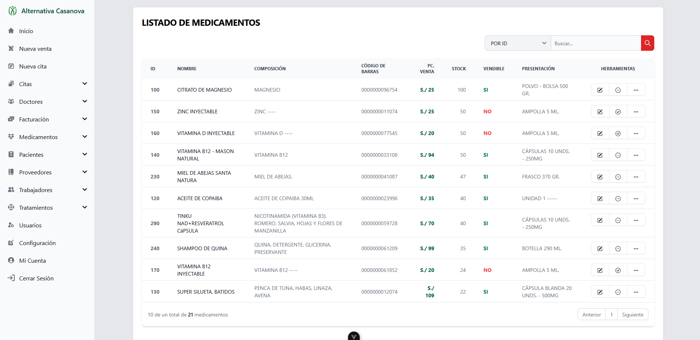

Registro de medicamento o productos
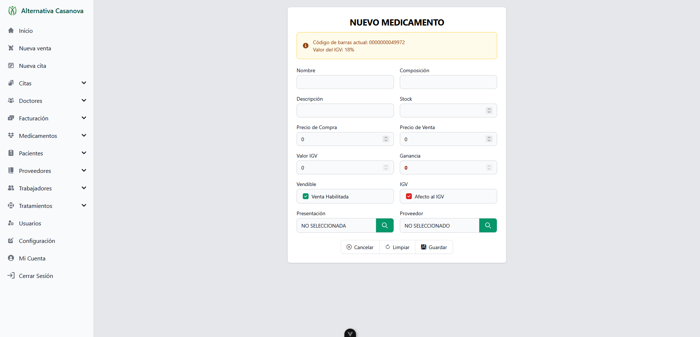

Registro de doctor y asignación de horario
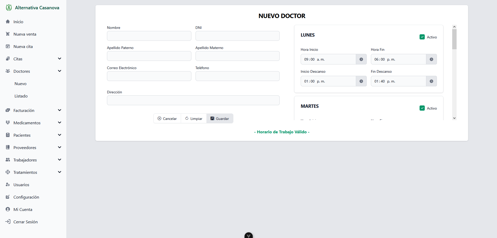

Listado de comprobantes
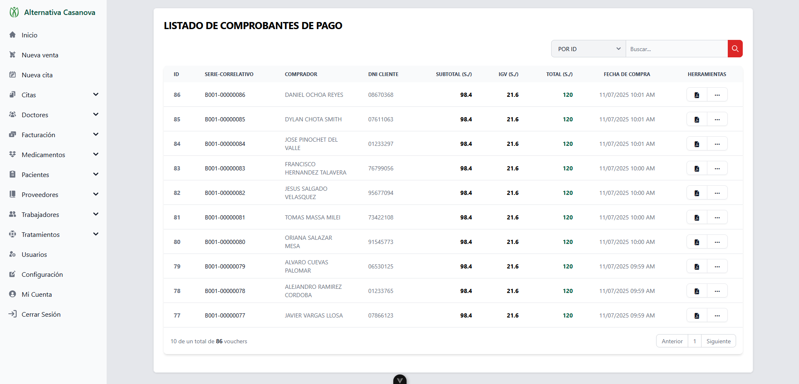

Detalle de comprobante en PDF
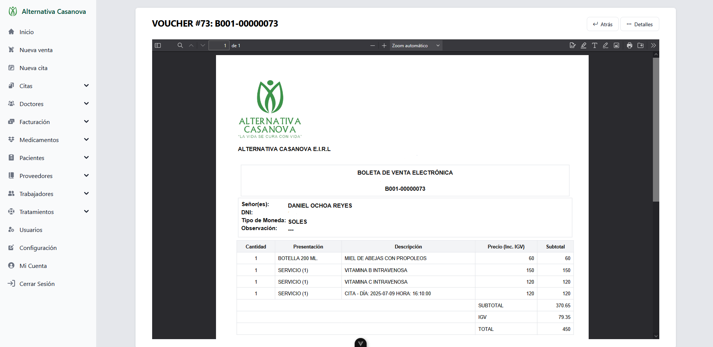

Reserva de citas
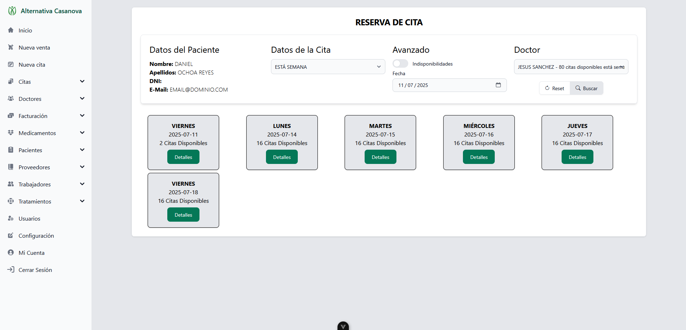

Reserva de citas (Selección de turno)
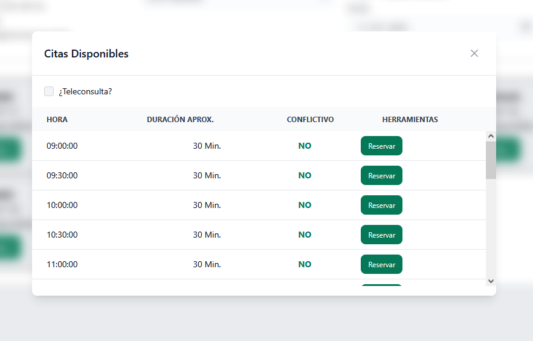

Módulo de ventas
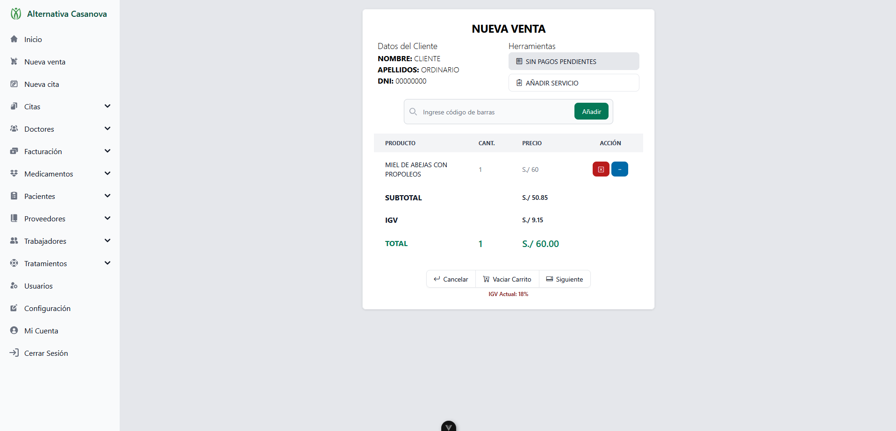

Reporte de ventas
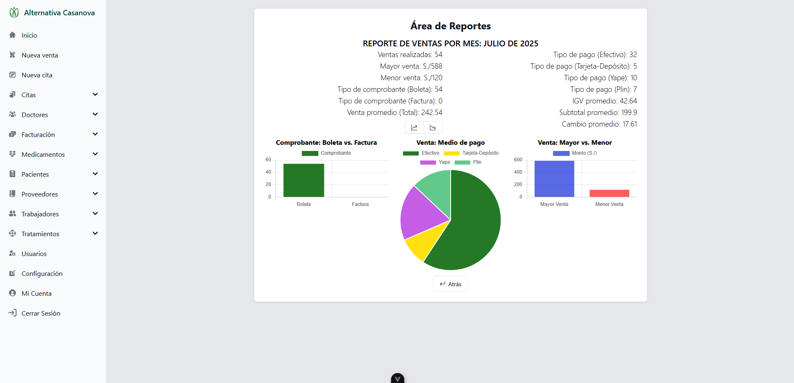

Listado de proveedores
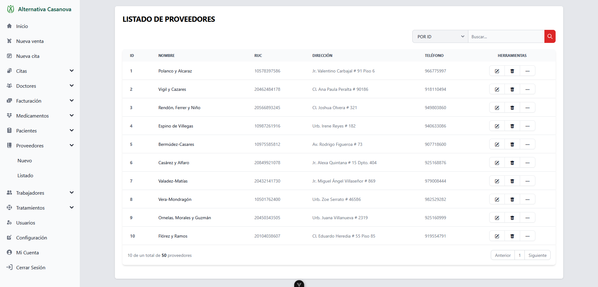

Configuración del sistema
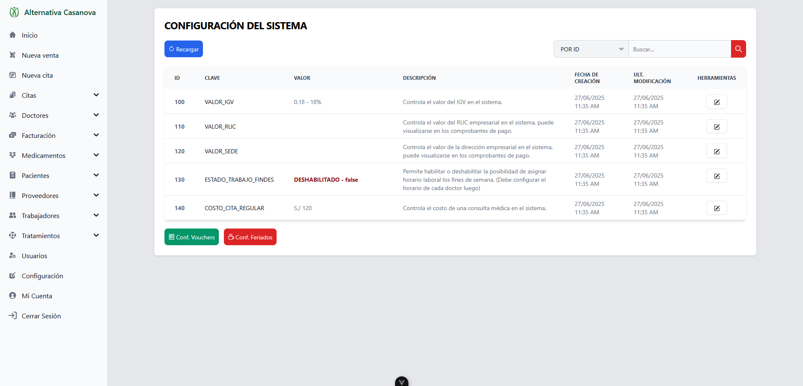

Perfil de Usuario
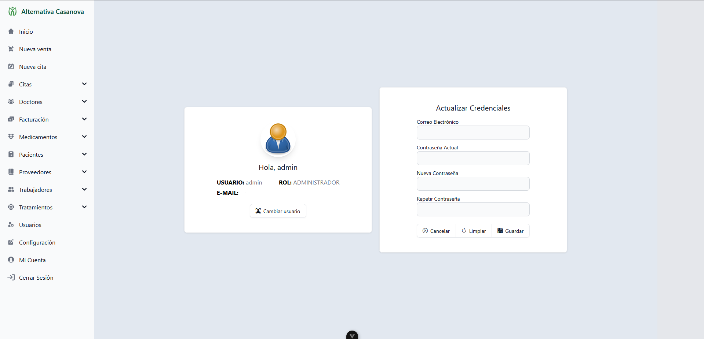